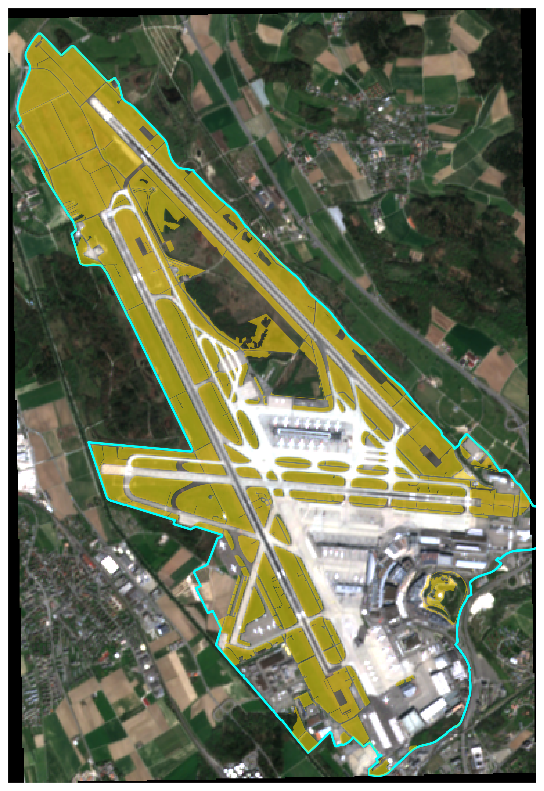
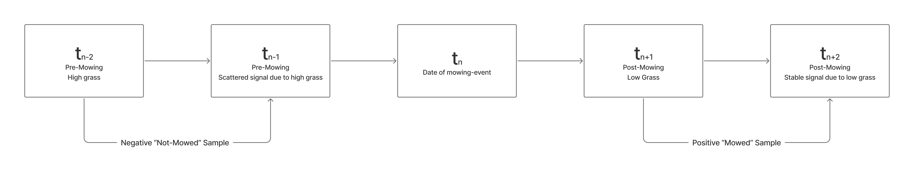

# Methods {#sec-methods}

## Study Area and Data Sources

The study area comprises the perimeter of Zurich Airport (Flughafen Zürich). The airport grasslands are subject to regular mowing regimes designed to manage vegetation height and reduce wildlife hazard risk. @fig-study-area illustrates the spatial extent of the study area, highlighting the airport boundary and the specific grassy areas within it that are relevant for mowing event detection. A detailed description of the study area and its operational context is provided in the preceding project work [@klaver2025].

{#fig-study-area width=60%}

The analysis draws on five primary data sources, summarised in @tbl-data-sources. Sentinel-2 multispectral imagery and the associated ground truth mowing records were carried over from the previous study [@klaver2025]. Sentinel-1 Single Ground Range Detected (GRD) and Look Complex (SLC) data were newly acquired for this thesis to add SAR features to the analysis. Grassland parcels from the official Swiss land survey (Amtliche Vermessung) were used to constrain the analysis to vegetated areas and exclude non-grassland areas such as forests, built-up surfaces, roads, and runways. 

| Source | Product | Resolution | Period | Provider |
|:--|:--|:--|:--|:--|
| Sentinel-2 | L2A multispectral | 10 m | 2019--2023 | Google Earth Engine |
| Sentinel-1 | IW GRD | 10 m | 2019--2023 | Google Earth Engine |
| Sentinel-1 | IW SLC | 5 x 20 m | 2019--2023 | CDSE |
| Ground truth | Mowing polygons | Vector | 2019--2023 | Zurich Airport |
| Land survey | Grassland parcels | Vector | 2017 | Kanton Zürich |

: Overview of data sources. All Sentinel-1 products use C-band. GRD data were obtained from Google Earth Engine and SLC data from the Copernicus Data Space Ecosystem (CDSE). The land survey data originate from the Amtliche Vermessung [@zh_geodata_2025]. {#tbl-data-sources}

The Sentinel-2 archive contains 201 cloud-masked scenes across the study period. No data were available for 2022 due to a gap in the local archive. The ground truth dataset consists of 1,899 mowing event polygons, recorded by farmers responsible for the mowing on maps and digitalised by project staff of the ZHAW. Each polygon is attributed with a mowing date. These records were cleaned by intersecting them with the grassland class from the Swiss land survey and removing fragments smaller than 400 m², resulting in 3,008 polygon fragments from 1,860 unique mowing events [@klaver2025].

At the beginning of this thesis, extensive efforts were made to acquire additional ground truth data from external institutions and research groups to expand the training and validation basis beyond the airport. However, no suitable datasets of sufficient size and with the required spatial and temporal resolution could be obtained. The analysis therefore relies mainly on the Zurich Airport ground truth for model training and evaluation. A small number of additional mowing records from Lindau (provided by Strickhof) and Aadorf (provided by Agroscope) were obtained for use in qualitative validation of the model's generalisation performance outside the airport study area.

## Sentinel-2 Preprocessing and Feature Engineering

The Sentinel-2 preprocessing and feature engineering workflow was carried over from the previous project work and is described in detail in @klaver2025. This section summarises the key steps and parameters for completeness. 

All 201 Sentinel-2 scenes were reprojected from EPSG:32632 (UTM Zone 32N) to EPSG:2056 (Swiss LV95) using bilinear resampling, producing a uniform reference grid of 559 by 381 pixels at 10 m resolution. This grid defines the spatial reference for all subsequent raster operations in the pipeline. Cloud masking was applied per pixel using the cloud probability band (band 13), setting all pixels with a probability exceeding 30% to NaN.

For each of the 227 ground truth mowing dates, the pipeline searches for a temporal triplet of three Sentinel-2 scenes in defined time windows relative to the event date, as shown in @tbl-temporal-windows and @fig-triplet-design. Events where all three images are available form a complete triplet. Of the 227 events, 92 produced valid triplets.

| Code | Role | Window | Selection | Purpose |
|:--|:--|:--|:--|:--|
| $t_{n-2}$ | Before far | 9--20 days before | Latest in window | Reference for negative samples |
| $t_{n-1}$ | Before near | 3--8 days before | Latest in window | Growth for negative + pre-mowing for positive samples |
| $t_{n+1}$ | After | 1--7 days after | Earliest in window | Post-mowing image for positive samples |

: Temporal matching windows for Sentinel-2 triplet construction. {#tbl-temporal-windows tbl-colwidths="[10, 15, 20, 25, 30]"}

{#fig-triplet-design width=100%}

For each triplet, two feature sets are computed. The positive (mowed) pair uses the before near and after images, while the negative (not mowed) pair uses the before far and before near images. Five vegetation indices are calculated for each pair: NDVI, EVI, SAVI, GNDVI, and NDII. Together with their temporal differences and the corresponding raw band values and differences, this yields 20 features per pixel. The vegetation index formulas and their spectral basis are documented in @klaver2025.

Training samples are drawn from within the ground truth polygons after applying a one-pixel (10 m) binary erosion to avoid edge effects at polygon boundaries. Sampling is balanced per event per class. After excluding events with insufficient valid pixels due to cloud cover, the final training dataset contains 33'368 samples from 63 unique mowing events.

## SAR Data Acquisition and Coherence Estimation {#sec-sar-processing}

### GRD Backscatter

As an initial approach, Sentinel-1 Ground Range Detected (GRD) images were acquired through Google Earth Engine for all training events. The GEE collection provided 471 ascending-orbit scenes in Interferometric Wide Swath (IW) mode with VV and VH polarisations over the study period. The images were speckle-filtered using a square spatial mean kernel with a 30 m radius, exported at 10 m resolution in EPSG:2056, and aligned to the Sentinel-2 reference grid. Six features were derived per event from the before near and after GRD images: the absolute VV, VH, and cross-ratio (VH minus VV) values of the after image, and the corresponding temporal differences.

However, preliminary experiments during the development phase indicated that GRD backscatter features did not provide sufficient discriminative power for mowing detection (see @sec-test-performance for details). This motivated the transition to interferometric coherence derived from SLC products, which captures phase-level information not available in GRD data [@tamm2016].

### SLC Acquisition

Single Look Complex (SLC) products were acquired from the Copernicus Data Space Ecosystem (CDSE) [@copernicus_s1_2025] using the cdsetool Python library [@cdsetool_pypi]. A metadata query for ascending IW SLC products over the study area between 2019 and 2023 returned 633 available scenes. From these, relative orbit 15 was selected as it provides the most consistent coverage over Zurich Airport (387 scenes). The IW2 subswath was identified as covering the study area for this orbit geometry.

### Coherence Quadruplet Design

The coherence feature design requires a different temporal logic than the optical features. While vegetation indices capture the spectral state at a single point in time, interferometric coherence quantifies the phase stability between two SAR acquisitions. Tall, unmowed grass produces low coherence due to wind-induced movement, short stubble after mowing presents a stable surface with high coherence. Critically, a coherence pair spanning the mowing event itself would also yield low coherence, because the surface changed between acquisitions, making it indistinguishable from the unmowed case.

To resolve this, the coherence estimation uses four SLC acquisitions per mowing event rather than the three used for optical features (see @fig-quadruplet-coh). For the negative (not mowed) class, coherence is computed between two pre-mowing acquisitions ($t_{n-2}$ to $t_{n-1}$), both captured while the grass is tall and signal unstable. For the positive (mowed) class, coherence is computed between two post-mowing acquisitions ($t_{n+1}$ to $t_{n+2}$), both captured after the grass has been
cut and the signal is stable.

{#fig-quadruplet-coh width=100%}

The first three SLC dates are matched to the optical triplet dates within a tolerance of 8 days, while the fourth acquisition ($t_{n+2}$) is selected as the next same-orbit overpass exactly 6 or 12 days after $t_{n+1}$. All temporal baselines within each coherence pair must equal 6 or 12 days, corresponding to the Sentinel-1 repeat cycle All acquisitions must originate from the same relative orbit and subswath to preserve the phase relationship. Of the 92 events with the full S2 temporal triplet, 72 produced valid SLC quadruplets. The remaining 20 events were excluded because they did not fulfil the strict temporal matching criteria.

### SNAP Processing

Interferometric coherence was computed using ESA's SNAP Graph Processing Tool (GPT), called from Python via subprocess in batch mode [@snap_platform; @snap_gpt_docs]. For each SLC pair, the processing chain applied subswath splitting (IW2, VV and VH), precise orbit correction, back-geocoding with the SRTM 3-arcsecond DEM, and coherence estimation using a 19 x 5 pixel averaging window following Tamm et al. [-@tamm2016]. The result was debursted and terrain-corrected to a 20 m output grid in EPSG:2056 using the SRTM 1-arcsecond DEM, producing a two-band GeoTIFF with VV and VH coherence values in [0, 1].  

A subset of SLC pairs produced invalid coherence outputs all bands contained only zero values, despite SNAP reporting successful processing. The cause of these silent failures could not be identified nor fixed, and affected 36 of the 72 pairs.  Affected events were detected by automated validation checks and excluded from further analysis, reducing the number of valid coherence pairs to 36. Manual inspection of affected outputs confirmed that all bands contained exclusively zero values despite correct input data, but no consistent pattern in acquisition date, orbit geometry, or temporal baseline could be identified as the cause.

### SNR Decorrelation Correction

Following the approach described by Tamm et al. [-@tamm2016], a post-hoc correction for signal-to-noise ratio (SNR) decorrelation was applied to all coherence rasters. The correction isolates the temporal decorrelation component by dividing the measured coherence by the estimated SNR decorrelation factor, $\gamma_{SNR}$.

The SNR decorrelation factor for an interferometric pair was estimated using GRD backscatter images as a proxy for the radar cross-section $\sigma^0$. For each SLC acquisition date, the nearest GRD image within 3 days was identified and resampled from the 10 m GRD grid to the 20 m coherence grid. The per-pixel SNR decorrelation was then computed following Equation 3 of Tamm et al. [-@tamm2016]:
$$\gamma_{SNR} = \frac{1}{\sqrt{\left(1 + \frac{1}{SNR_{t_1}}\right)\left(1 + \frac{1}{SNR_{t_2}}\right)}}$$ {#eq-snr}

where $SNR = (\sigma^0 - NESZ) / NESZ$ for each acquisition. The noise equivalent sigma zero (NESZ) was approximated as -25.0 dB for VV and -27.0 dB for VH polarisation. These values fall within the range of measured NESZ performance for the IW2 subswath, which is typically several decibels below the mission requirement specification of -22 dB reported in the system documentation [@sentinel1handbook2013]. Because per-pixel NESZ varies with incidence angle and burst position, these fixed approximations introduce some uncertainty into the correction, particularly for low-backscatter pixels near the noise floor. A minimum floor of $\gamma_{SNR} = 0.10$ was applied to prevent excessive amplification in low-backscatter areas. The corrected coherence was obtained as $\gamma_{corrected} = \gamma_{measured} / \gamma_{SNR}$, clipped to [0, 1].

To quantify the effect of both raw and SNR-corrected coherence on class separability, Cohen's $d$ effect sizes and Mann-Whitney p-values were computed between mowed and unmowed parcels on post-event coherence (coh_after) for each polarisation and seasonal window. This analysis compares coherence spatially across parcels: for a given event window, the post-event coherence of parcels where mowing was recorded is compared against parcels where no mowing occurred. The growing season was divided into three periods: early (April to May), peak (June to July), and late (August to October). Based on the quadruplet design described above, a positive Cohen's $d$ indicates that mowed parcels show higher post-event coherence than unmowed parcels. The results of this analysis are reported in @sec-coherence-results.

## Feature Fusion and Model Configurations {#sec-feature-fusion}

To combine features from different sensor sources, GRD and coherence values were attached to the existing Sentinel-2 training samples by sampling the corresponding rasters at the exact geographic coordinates of each pixel. For GRD features, which share the same 10 m grid as the Sentinel-2 data, this extraction is spatially exact. Coherence rasters, produced at 20 m resolution, were resampled to the 10 m grid using bilinear interpolation before sampling. Because the Sentinel-2 samples were filtered for cloud cover during the optical preprocessing stage, not all events with valid coherence rasters retained usable training pixels. Consequently, the dataset was divided into two distinct groups to accommodate the differing data availability. Group A comprises the full set of 63 events with valid Sentinel-2 and GRD data, yielding 33,368 samples. Group B consists of the restricted subset of 24 events that also possess valid interferometric coherence pairs and corresponding cloud-free Sentinel-2 samples, consisting of 15,311 samples. 

The assignment of coherence values follows the quadruplet design described in @sec-sar-processing. Positive samples (label = 1, mowed) receive coherence values from the post-mowing pair ($t_{n+1}$ to $t_{n+2}$), representing short vegetation. Negative samples (label = 0, not mowed) receive coherence values from the pre-mowing pair ($t_{n-2}$ to $t_{n-1}$), representing tall vegetation. Both VV and VH polarisation coherence values are included as features.

The data were split into training and test sets using GroupShuffleSplit with a test fraction of 0.2, grouped by event identifier (match_id). This ensures that all samples from a given mowing event appear exclusively in either the training or the test set, preventing data leakage between spatially and temporally correlated pixels. For Group A, this procedure produced a split of 50 training and 13 test events (24,945 and 8,423 samples respectively). For Group B, the split resulted in 19 training and 5 test events (12,023 and 3,288 samples).

Feature selection was performed exclusively on the training split to prevent test-set leakage. This step was conducted on both sample subsets A and B and the results compared to find the best feature sets. Compared to the preceding project work [@klaver2025], which relied on simpler reduction, a more systematic feature importance analysis was conducted using three complementary methods: Pearson correlation analysis to identify redundant feature pairs (threshold $∣r∣ > 0.85$), Mean Decrease Impurity (MDI) from a preliminary Random Forest classifier to rank features by their contribution to node purity [@breiman2001], and permutation importance to quantify each feature’s contribution to generalisation performance by measuring the decrease in F1-score after randomly shuffling that feature [@altmann2010]. Features with permutation importance values near zero or below zero were mostly discarded, and among correlated pairs the feature with the lower importance was removed.  

While these analytical methods identified several post-event (_after) features as highly informative, temporal difference features (_diff) are considered structurally more robust across different sites and conditions, as they capture relative change rather than absolute reflectance that varies with soil type, grass species, or geography. Consequently, the final model configurations balanced the analytical findings with domain expectations. The detailed outcomes are presented in @sec-feature-importance.

Eight model configurations were defined across the two groups, as summarised in @tbl-model-configs. Configurations within Group A utilise Sentinel-2 and GRD features exclusively. Configurations within Group B incorporate the coherence features alongside the optical and GRD data. Because the two groups utilise separate train-test splits, their respective performance metrics are not directly comparable.

| Config | Features | n | Group |
|:--|:--|:--|:--|
| S2-only_best | ndii_diff, gndvi_diff, swir_diff, ndii_after, swir_after | 5 | A |
| S2-only_diff | ndii_diff, gndvi_diff, swir_diff | 3 | A |
| GRD-only | vh_diff, cr_diff, cr_after, vh_after | 4 | A |
| S2+GRD | S2-only_best + GRD-only | 9 | A |
| Coh-only | coh_vv, coh_vh | 2 | B |
| S2_best+Coh | S2-only_best + Coh-only | 7 | B |
| S2_diff+Coh | S2-only_diff + Coh-only | 5 | B |
| Full-fusion | S2-only_best + GRD-only + Coh-only | 11 | B |

: Model configurations and their feature sets. S2-only_best refers to the 5 optical features selected through the feature importance analysis (including two _after_ features). S2-only_diff refers to the 3 strongest temporal difference features. GRD-only refers to the four backscatter features retained after pruning. Coh-only includes both coherence features (coh_vv, coh_vh). *n* refers to the number of features in each configuration. {#tbl-model-configs tbl-colwidths="[20, 60, 10, 10]"}

## Classification and Threshold Calibration

Following the same approach as in the previous study [@klaver2025], three classifiers were trained for each of the eight model configurations: Support Vector Machine (SVM) [@cortes1995], Random Forest (RF) [@breiman2001], and Light Gradient Boosting Machine (LGBM) [@ke2017]. All classifiers were implemented using scikit-learn compatible pipelines. The SVM pipeline includes a StandardScaler for feature normalisation prior to classification. The tree-based models (RF, LightGBM) operate on unscaled features.

Hyperparameter tuning was performed using GridSearchCV with GroupKFold cross-validation (5 folds), optimising for the F1-Score. The parameter grids are summarised in @tbl-hyperparams.

| Classifier | Parameter | Values |
|:--|:--|:--|
| SVM | C | 0.1, 1, 10 |
| SVM | gamma | scale, auto |
| RF | n_estimators | 100, 200 |
| RF | max_depth | None, 10, 20 |
| LightGBM | num_leaves | 31, 63 |
| LightGBM | learning_rate | 0.05, 0.1 |

: Hyperparameter search grids used in GridSearchCV. {#tbl-hyperparams}

The default classification threshold of 0.5 on the predicted probability is calibrated for balanced class distributions. At real scene-level class balance, where often less than 10% of grassland pixels are mowed at any given time, this threshold produces excessive false positive predictions. To address this, a scene-level threshold calibration was performed using a leave-one-out (LOO) approach [@sklearnloo] over six mostly cloud-free calibration scenes with available ground truth. For each calibration scene, the full feature set was computed and the model was applied across a threshold sweep from 0.10 to 0.95 in steps of 0.05. The threshold maximising the F1-Score was recorded per scene, and the final operational threshold was set as the median across all calibration scenes. This calibration was performed independently for each of the models that were actually applied on full scenes later. Certain models that performed poorly in training were not included in the scene-level evaluation and threshold calibration, as they were not considered for operational use. The final calibrated thresholds are reported in @sec-threshold-results.

## Spatial Postprocessing {#sec-postprocessing}

Three spatial postprocessing methods were applied to the binary classification outputs to reduce salt-and-pepper noise and improve spatial consistency. The methods operate on the predicted mowing maps, where each pixel is encoded as mowed (1), not mowed (0), or nodata (-1).

The first method is a median filter with a configurable window size, which replaces isolated misclassified pixels with the majority label of their local surroundings. The second method applies morphological operations in sequence: binary opening (erosion followed by dilation) removes small spurious detections, followed by binary closing (dilation followed by erosion) to fill small gaps within classified regions. Both operations use a disk-shaped structuring element with a configurable radius. After the morphological operations, connected components smaller than a specified minimum area are removed. The third method uses SLIC superpixel segmentation to aggregate pixel-level predictions. The segmentation is computed from the spectral bands of the input scene and within each resulting segment, majority voting assigns all pixels the dominant class label.

The three methods can be chained in sequence. To determine the optimal postprocessing configuration, a grid search was performed over the parameter space defined in @tbl-pp-grid. Each configuration was evaluated on the six calibration scenes used for threshold calibration, and the configuration maximising the mean F1-Score across all scenes was selected as the operational postprocessing setting. The grid search was conducted using the most stable model from the scene-level evaluation before postprocessing (S2_only_diff SVM) with its calibrated threshold. The resulting best configuration and its effect on classification performance are reported in @sec-postprocessing-results.

| Parameter | Values |
|:--|:--|
| Median pre-filter | 0, 3, 5, 7 |
| Disk radius (morphological) | 1, 2, 3, 4 |
| Min. component area (pixels) | 2, 4, 6, 8 |
| SLIC segments | 200, 300, 400 |
| SLIC compactness | 0.05, 0.1 |

: Postprocessing parameter grid. Each combination of morphological parameters was tested with and without a preceding median filter, and with and without subsequent SLIC aggregation producing a total of 448 combinations. {#tbl-pp-grid}

## Evaluation {#sec-evaluation}

Model performance was assessed at two levels. On the training data, pixel-level classification performance was evaluated using standard metrics, specifically accuracy, precision, recall, the F1-Score, and the Area Under the Receiver Operating Characteristic Curve (ROC AUC) [@sklearnmetrics]. Additionally, confusion matrices were generated to visualize the balance between false positive and false negative predictions. These metrics were computed for each model configuration using the held-out test events from the GroupShuffleSplit.

Pixel-based metrics on sampled training data can overestimate true operational performance in geospatial domains [@meyer2019spatialvalidation; @ploton2020]. Therefore, based on test-set performance across all 24 trained models, 11 were selected for scene-level evaluation. The selection prioritised the best-performing SVM and RF variants across the feature configurations, while excluding LightGBM models, which consistently underperformed in this and the preceding study. Since multiple mowing events can occur within the temporal window spanned by a scene pair, a composite ground truth mask was constructed for each evaluation scene. This mask distinguishes between definite mowing pixels, where the ground truth unambiguously indicates mowing within the scene pair interval, and boundary pixels, where the temporal assignment is ambiguous due to overlapping or adjacent events (e.g., event occuring at the same date as the before- or after-image of the chosen scene). Such boundary pixels were excluded from both the positive and negative class during scoring to avoid penalising the model for predictions in temporally uncertain areas. Pixel-level accuracy, precision, recall, and F1-Score for the mowed class were computed on the remaining definite and non-mowed pixels. Each model was evaluated on two mostly cloud-free composite scenes using its LOO-calibrated threshold, both with and without the best postprocessing configuration determined by the grid search described in @sec-postprocessing. Spatial difference maps showing true positives, false positives, false negatives, and boundary detections overlaid on the Sentinel-2 RGB composite were generated to support qualitative assessment of prediction patterns and error sources. 

To directly quantify the improvement over the preceding study, the best-performing model from PW2 (SVM trained on ndii_diff as the sole feature) was applied to the same two evaluation scenes using its original default threshold of 0.5 and without postprocessing. This allows a fair comparison between the previous and current workflow under identical scene conditions.

In addition to the standard evaluation on mowing scenes, a control test was conducted to assess the model's false positive behaviour in the absence of mowing. For a selected event, the S2_only_diff SVM model was applied to the before-far ($t_{n-2}$) to before-near ($t_{n-1}$) image pair rather than the before-near to after pair. In this time window, no mowing is expected to have occurred on the areas identified as mowed in the ground truth for the true event period. The control test measures the proportion of ground truth mowed pixels that the model incorrectly predicts as mowed during this non-mowing period. A low false positive rate in the control window provides additional confidence that the model responds to actual mowing signals rather than to unrelated spectral or coherence variations.

## Operational Prototype and Generalisation Test {#sec-prototype}

To support practical application of the developed methodology, a standalone prototype was produced as an interactive Jupyter Notebook. The tool is designed for end-users such as environmental researchers or land managers, allowing them to apply the mowing detection workflow without requiring the full training pipeline or dependencies on the project's source code. The user provides two Sentinel-2 GeoTIFFs (a before and after image bracketing the suspected mowing event), loads a pre-trained model file, and optionally supplies a study area boundary, grassland mask, or ground truth polygons for evaluation. The notebook then handles feature computation, cloud masking, model prediction, and postprocessing automatically. Only the S2-only model configurations are included, as the acquisition and preprocessing complexity of interferometric coherence estimation would undermine the tool's purpose as a lightweight, accessible application.

To evaluate the spatial transferability of the most stable model from this thesis (S2_only_diff SVM), the prototype was applied to an area near Lindau (Canton Zurich), entirely outside the airport training domain and temporally separated from the training period (2019-2023). Ground truth data consisting of four mowing event polygons dated 02.05.2025 were provided by Strickhof. Two Sentinel-2 scenes covering the area were manually downloaded from the Copernicus Browser (30.04.2025 as the before image, 10.05.2025 as the after image). The model was applied over the full scene extent without restricting the analysis to grassland areas, simulating a realistic use case where no prior land cover information is available. The resulting mowing predictions were compared to the ground truth polygons to assess the model's generalisation performance in a new geographic context.

## Use of Generative AI Tools

Generative AI tools were used as support during the development of this thesis. Claude (Anthropic, Claude Opus 4.6) was used for code development assistance, particularly for SAR data processing workflows with SNAP and Google Earth Engine, and for refining the language of the written report. Perplexity AI was used to support the initial identification of relevant scientific literature, with all sources subsequently verified and retrieved from primary databases. DeepL Translator and DeepL Write were used for translation between English and German and for language refinement. In all cases, the scientific content, methodological decisions, and interpretation of results are the author's own work. All AI outputs were critically reviewed and verified before use. In particular, literature references identified through Perplexity AI required systematic verification, as initial suggestions frequently included misattributed or non-existent sources. A complete list of the tools and their specific purposes is provided in the List of Used AI Tools.