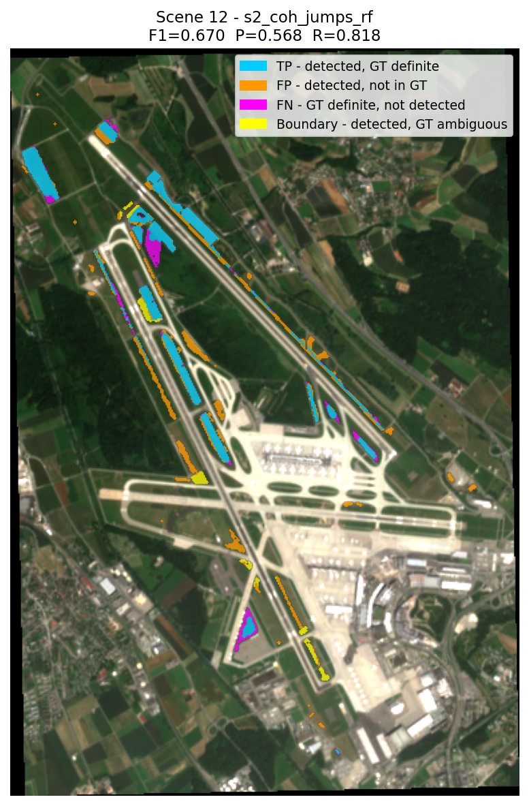
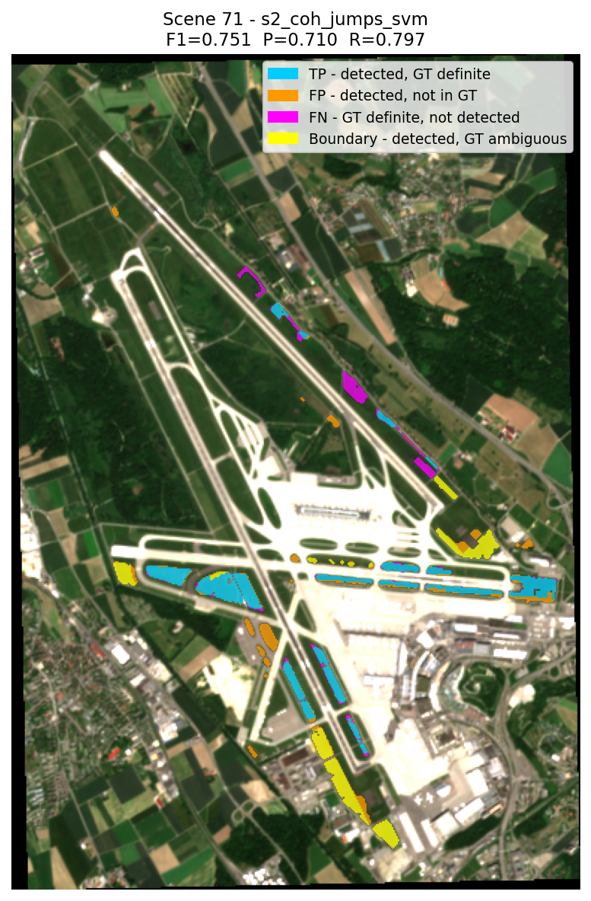

# Results {#sec-results}
## Test-Set Classification Performance
Content: Comparison of all model configurations on their respective test sets --> core quantitative comparison.

Planned table: A table showing F1-Score, precision, recall, and ROC-AUC for the relevant models (best and worst performing, specific for research question. Not all 24 as this would overload the results. Table of all 24 model results in appendix). Group A and Group B results separated clearly, with a note that they are not directly comparable due to different test sets.

Planned figure: Bar chart ofr important F1-scores, Confusion matrices and ROC curves the the respective models

Key narrative points: Show training results, differences in feature sets and model type.

## Coherence Signal Analysis
Content: The VH coherence inversion finding. Show how SNR correction didn't resolve the issue if SAR signal (counterintuitive to expectation due to literature)

Planned table or figure: Distribution of the coherence signal for VV and VH, with and without SNR correction, for mowed vs. unmowed areas. Boxplot or histogram, table with explicit means/medians, variance etc. for each combination

Key narrative points: VV behaves as expected (mowed shows higher coherence jump), VH is inverted (mowed shows lower coherence jump), the combined jump feature carries a mixed signal, SNR correction amplifies the inversion rather than resolving it.

## Effect of Spatial Postprocessing
Content: Comparison of model performance with and without postprocessing methods (from posptocessing parameter grid search)
Planned table: F1-Score, precision, recall for the best model(s) under some postprocessing configurations (none, median, morphological, SLIC, chained combinations). 

Planned figure: Side-by-side prediction maps showing raw vs. postprocessed output for one example scene, with TP/FP/FN colour coding. 

Key narrative points: Does postprocessing improve F1? Does it primarily reduce false positives (improving precision) or does it also remove true positives (hurting recall)? Which method or combination works best?

## Operational Scene Application
Content: Results from applying the best model(s) to full scenes, including the LOO-calibrated threshold.

Planned figure and table: One or two example scenes showing the prediction map overlaid on RGB, with the TP/FP/FN difference map alongside the ground truth. (same as in PW2). Directly compare best model from PW2 with best final model from this thesis to show improvement. Table of F1, precision, recall for the full scene application.

Key narrative points: How the model performs at real scene-level class balance, the importance of threshold calibration, spatial patterns of errors (edge effects, shadow areas, non-grassland false positives). Impact of all these improvements on the operational usability of the model (compared to PW2 baseline).

**Two visualizations just for this draft to show what some of the best models currently look like on 2 different scenes. Yellow Pixels represent Areas that the model predicted as mowed and the ground truth mask also shows as mowed, but on boundary dates (ground truth from event dates same as before or after image and therefore uncertain if truly mowed or not, since exact mowing time and S2 time unknown)**

{width=60%}

{width=60%}

## Generalisation Test 
Content: Qualitative results from applying the model to the Lindau/Aadorf patches (Minimal test on additional patches from agroscope or Strickhof) to check generalisation on completly unknown areas.

Planned figure: Prediction map on the external area, with visual comparison to known mowing extent.

Key narrative points: Does the model generalise at all to external, completely unknown areas? What breaks? 