# Results {#sec-results}
## Interferometric Coherence and SNR Correction Analysis
@tbl-coherence-seasonal summarises the mean post-mowing coherence values, Cohen's $d$ effect sizes, and p-values for both raw and SNR-corrected signals across the three seasonal windows.

```{python}
#| tbl-cap: "Mean post-mowing coherence by class and season. Mowed and Not mowed columns show the mean coherence of the respective class after the event. Cohen's d quantifies the effect size between classes."
#| label: tbl-coherence-seasonal
#| echo: false

import pandas as pd
from great_tables import GT, md, style, loc

# Load data
data = pd.read_csv("tables/seasonal_coherence_comparison.csv")

# Drop unneeded columns to focus on the post-mowing shifts
data = data.drop(columns=["n_mowed", "n_not_mowed", "mean_before_mowed", "mean_before_not_mowed"])

# Rename columns to avoid issues with special characters in GT kwargs
data = data.rename(columns={
    "Pol": "Pol.",
    "Version": "Correction",
    "mean_after_mowed": "Mowed",
    "mean_after_not_mowed": "Not mowed",
    "Cohen's d (after)": "Cohen's d",
    "MW p (after, mow>not)": "p-value"
})

# Shorten cell values
data["Correction"] = data["Correction"].replace({
    "Original": "Raw",
    "SNR-corrected": "SNR-corr."
})

# Create and style the table
(
    GT(data)
    .fmt_number(
        columns=["Mowed", "Not mowed", "Cohen's d", "p-value"],
        decimals=3
    )
    .tab_options(
        table_font_size="10pt",  
        heading_title_font_size="12pt",
        data_row_padding="3px",
        table_border_top_color="black",
        table_border_bottom_color="black",
        heading_border_bottom_color="gray"
    )
    .opt_row_striping() 
)

```

VH polarisation during the late season was the only configuration that produced a positive Cohen's $d$, with mowed parcels showing higher mean post-event coherence than unmowed parcels. This separation is also visible in the density distributions (@fig-vh-density), where the mowed class is shifted to the right relative to the unmowed class.

In the early and peak growth seasons, both polarisations produced negative Cohen's $d$ values, with mowed parcels showing lower post-event coherence than unmowed parcels. VV polarisation showed near-zero effect sizes across all seasons, with consistently high p-values.

The SNR correction increased the magnitude of Cohen's $d$ and lowered the associated p-values across most configurations, but did not change the sign of the effect in any season-polarisation combination.

{#fig-vh-density}


## Feature Importance and Selection
@fig-perm-importance-A and @fig-perm-importance-B show the permutation importance of all candidate features for Group A (26 features, no coherence) and Group B (28 features, including coherence). In both groups, optical vegetation index features occupy the top ranks, while GRD backscatter features and absolute coherence values show negligible or negative importance.

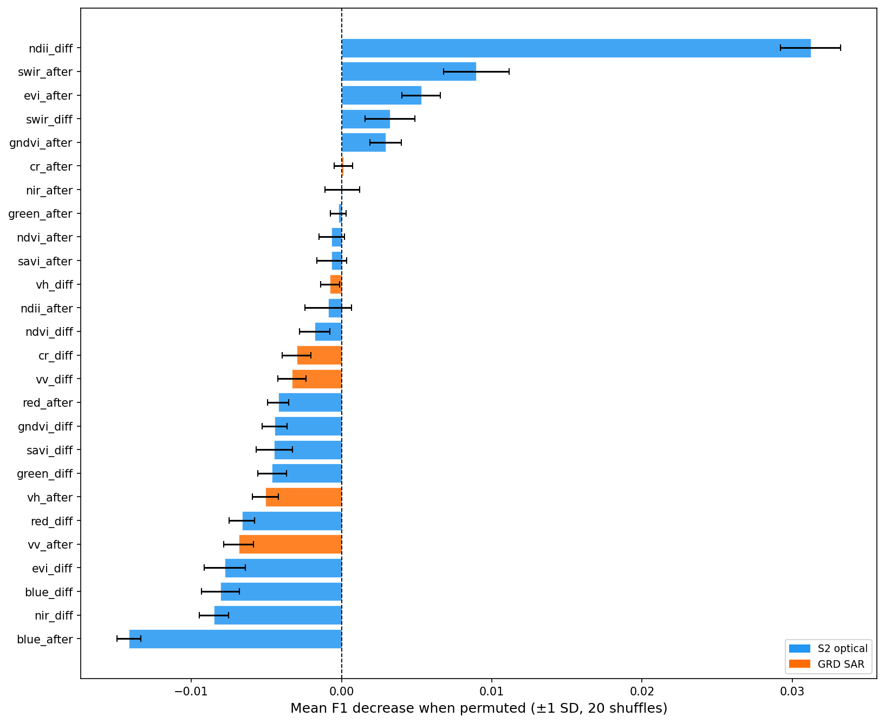{#fig-perm-importance-A width=80%}

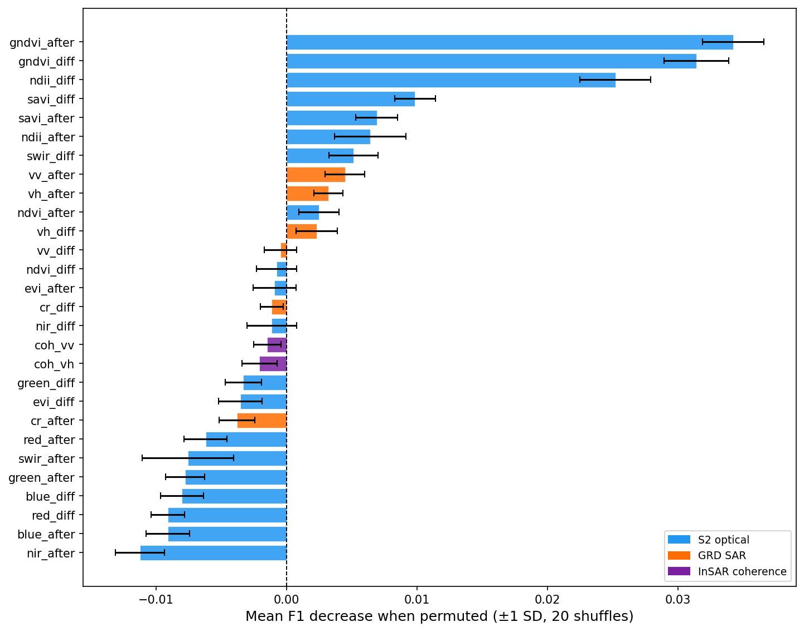{#fig-perm-importance-B width=80%}

In Group A, ndii_diff is the single dominant predictor, followed by swir_after, evi_after, and swir_diff. No GRD feature reaches positive importance. In Group B, the ranking shifts substantially: gndvi_after and gndvi_diff become the two strongest predictors, while ndii_diff drops to rank three. Features such as gndvi_diff, which shows negative importance in Group A, appear among the most informative in Group B. The absolute coherence values (coh_vv, coh_vh) show near-zero importance in both groups. The final feature sets for each model configuration (@tbl-model-configs) were derived from these rankings in combination with domain knowledge, as described in @sec-methods.


## Test-Set Classification Performance
@tbl-model-results summarises the test-set performance of all 24 model configurations across both groups. The F1 comparison across all configurations is shown in @fig-f1-comparison.

```{python}
#| tbl-cap: "Test-set classification performance for all model configurations. Group A models were evaluated on 13 held-out events (8,423 samples), Group B models on 7 held-out events (3,288 samples). Results across groups are not directly comparable due to different test sets."
#| label: tbl-model-results
#| echo: false

import pandas as pd
from great_tables import GT

data = pd.read_csv("tables/model_training_summary.csv")

data = data[["Model", "Num_Features", "F1_Score",
             "Precision", "Recall", "ROC_AUC", "Group"]]

data = data.rename(columns={
    "Model": "Configuration",
    "Num_Features": "n",
    "F1_Score": "F1",
    "ROC_AUC": "AUC"
})

data["Configuration"] = data["Configuration"].str.replace("_", " ")

(
    GT(data)
    .cols_label(
        Configuration="Configuration",
        n="n",
        F1="F1",
        Precision="Precision",
        Recall="Recall",
        AUC="AUC",
        Group="Group"
    )
    .fmt_number(
        columns=["F1", "Precision", "Recall", "AUC"],
        decimals=3
    )
    .tab_options(
        table_font_size="10pt",
        heading_title_font_size="12pt",
        data_row_padding="3px",
        table_border_top_color="black",
        table_border_bottom_color="black",
        heading_border_bottom_color="gray"
    )
    .opt_row_striping()
)
```

{#fig-f1-comparison}

Within Group A, the S2-only configurations achieve the highest F1-Scores, with the SVM reaching 0.923 using five optical features. Reducing the feature set to only the three difference features (ndii_diff, gndvi_diff, swir_diff) produces a minimal drop to 0.920. Adding GRD backscatter features to the optical set does not improve performance: the S2+GRD RF achieves 0.919, marginally below the S2-only baseline. The GRD-only configurations achieve F1-Scores between 0.467 and 0.528, near the random baseline.

Within Group B, the Full-fusion RF achieves the highest F1-Score of 0.922, followed by S2_best+Coh RF at 0.910. Coherence-only models perform near random (F1 between 0.468 and 0.479). The S2_diff+Coh configurations, which combine only difference features with coherence, achieve lower F1-Scores (0.841 to 0.861) than the S2_best+Coh configurations that include absolute post-event index values (0.899 to 0.910).

The choice of classifier has a smaller effect on performance than the choice of features. Across Group A, the spread between the best and worst algorithm for a given feature set is typically less than 0.01 F1. In Group B, the spread is larger, particularly for the Full-fusion configuration where RF (0.922) substantially outperforms SVM (0.859).

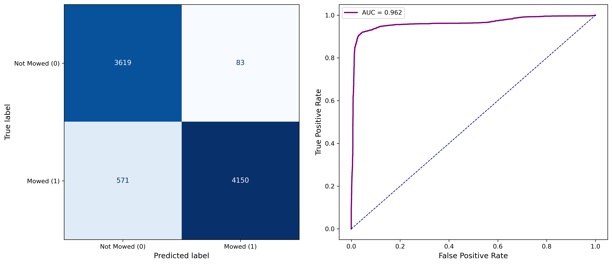{#fig-cm-best}


## Scene-Level Threshold Calibration {#sec-threshold-results}
The LOO-calibrated thresholds for all evaluated models are reported in @tbl-calibrated-thresholds. For all S2-based models, the calibrated thresholds range from 0.775 (Full-fusion RF) to 0.950 (S2_best+Coh RF), substantially above the default of 0.5. The coherence-only and GRD-only models show the opposite pattern, with calibrated thresholds at or near 0.1.

| Model | Calibrated threshold |
|:--|:--|
| S2-only_best RF | 0.925 |
| S2-only_best SVM | 0.875 |
| S2-only_diff RF | 0.875 |
| S2-only_diff SVM | 0.900 |
| S2_best+Coh RF | 0.950 |
| S2_diff+Coh RF | 0.850 |
| S2+GRD RF | 0.800 |
| Full-fusion RF | 0.775 |
| Coh-only RF | 0.100 |
| Coh-only SVM | 0.325 |
| GRD-only RF | 0.100 |

: Scene-level LOO-calibrated thresholds. Calibration was performed over six held-out scenes with ground truth. {#tbl-calibrated-thresholds}

The effect of threshold calibration is illustrated in @fig-threshold-calibration, which compares predictions on scene 46 using the model S2_only_diff RF with the default threshold (t = 0.50) and the calibrated threshold (t = 0.875), both without postprocessing. At the default threshold, the model achieves high recall (0.881) but low precision (0.327). The calibrated threshold raises precision to 0.499 and improves the F1-Score from 0.477 to 0.587, while recall decreases to 0.712. In the figure it is clearly visible that the thrshold calibration removes many of the scattered false positives, reducing salt-and-pepper noise.

::: {#fig-threshold-calibration layout-ncol=2}

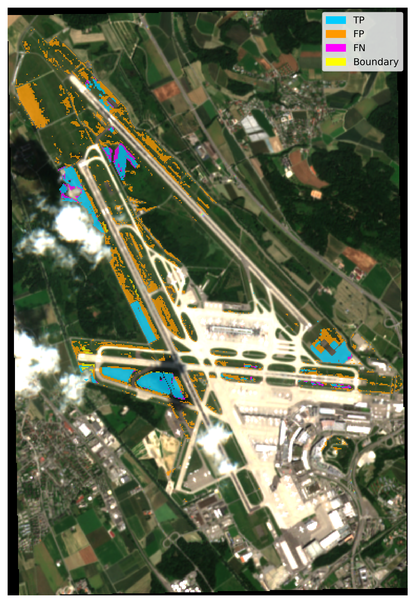{#fig-thresh-default}

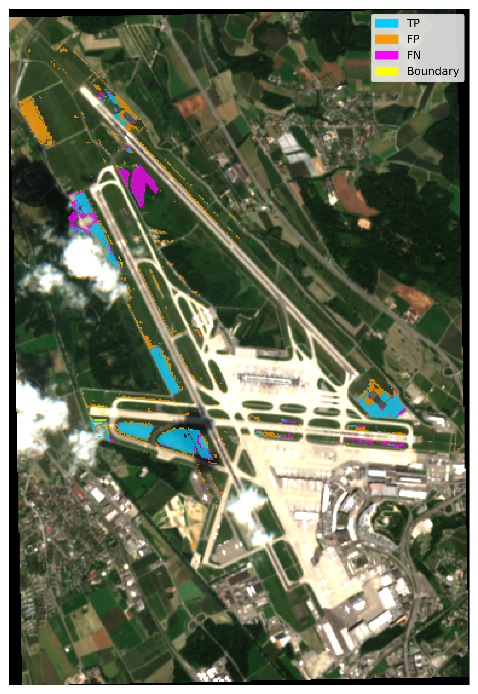{#fig-thresh-calibrated}

Prediction maps for scene 46 without postprocessing. (a) Default threshold of 0.50 (F1 = 0.477, P = 0.327, R = 0.881). (b) LOO-calibrated threshold of 0.875 (F1 = 0.587, P = 0.499, R = 0.712). Cyan: true positive, orange: false positive, magenta: false negative, yellow: boundary-ambiguous (predicted mowed, but ground truth mowing occurred exactly on the after-image date itself, making those pixels uncertain).
:::

## Effect of Spatial Postprocessing
The postprocessing parameter grid search was evaluated on six calibration scenes using one of the most stable and best performing model configurations (S2-only_diff RF). @tbl-pp-summary shows the best configuration from each method category alongside the baseline without postprocessing.

```{python}
#| tbl-cap: "Best postprocessing configuration per method category, averaged across six calibration scenes. Delta F1 is relative to the no-postprocessing baseline."
#| label: tbl-pp-summary
#| echo: false

import pandas as pd
from great_tables import GT

data = pd.read_csv("tables/pp_method_summary.csv")

data = data.rename(columns={
    "category": "Method",
    "f1": "F1",
    "delta_F1": "ΔF1",
    "median_size": "Median size",
    "disk_radius": "Disk r",
    "min_area_pixels": "Min. area",
    "n_segments": "Segments",
    "slic_compactness": "Compact."
})

(
    GT(data)
    .fmt_number(columns=["F1", "ΔF1"], decimals=3)
    .fmt_number(columns=["Median size", "Disk r", "Min. area", "Segments"], decimals=0)
    .fmt_number(columns=[ "Compact."], decimals=1)
    .sub_missing(missing_text="—")
    .tab_options(
        table_font_size="10pt",
        heading_title_font_size="12pt",
        data_row_padding="3px",
        table_border_top_color="black",
        table_border_bottom_color="black",
        heading_border_bottom_color="gray"
    )
    .opt_row_striping()
)
```

The overall effect of postprocessing on the F1-Score is small. The best-performing configuration, a median filter with a window size of 3x3 followed by morphological opening and closing with a disk radius of 1 pixel and a minimum component area of 4 pixels, achieved a mean F1 of 0.590 across the six calibration scenes, an improvement of +0.009 over the unprocessed baseline (0.581). Morphological operations alone produced a marginal decrease of -0.003. Configurations involving SLIC superpixel aggregation performed drastically worse, dropping to F1-Scores around 0.235.

The effect of postprocessing varies across scenes, as shown in @fig-pp-f1-comparison. For four of the six calibration scenes, the best postprocessing configuration produced a modest improvement in F1-Score, while for two scenes it resulted in a slight decrease.

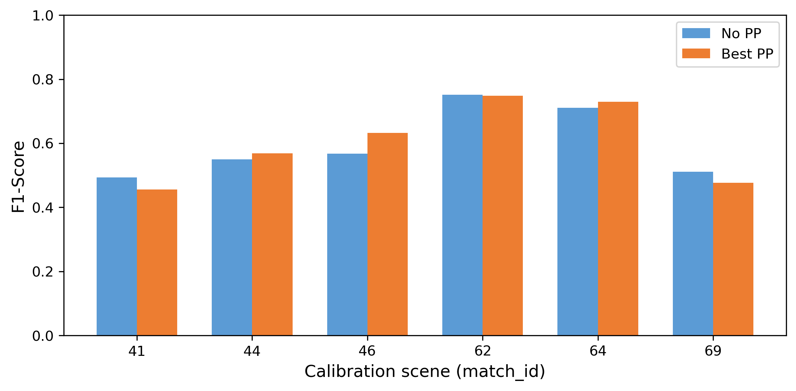{#fig-pp-f1-comparison width=65%}

@fig-pp-sidebyside illustrates the spatial effect of postprocessing on a single scene (match_id 46). The raw prediction (F1 = 0.587) contains scattered false positive pixels along parcel boundaries and near infrastructure, particularly visible as orange fragments along the runway strips. After postprocessing (F1 = 0.667), these isolated detections are removed, producing cleaner parcel boundaries and reducing the false positive area. The false negative regions (magenta) remain largely unchanged.

::: {#fig-pp-sidebyside layout-ncol=2}

{#fig-pp-raw}

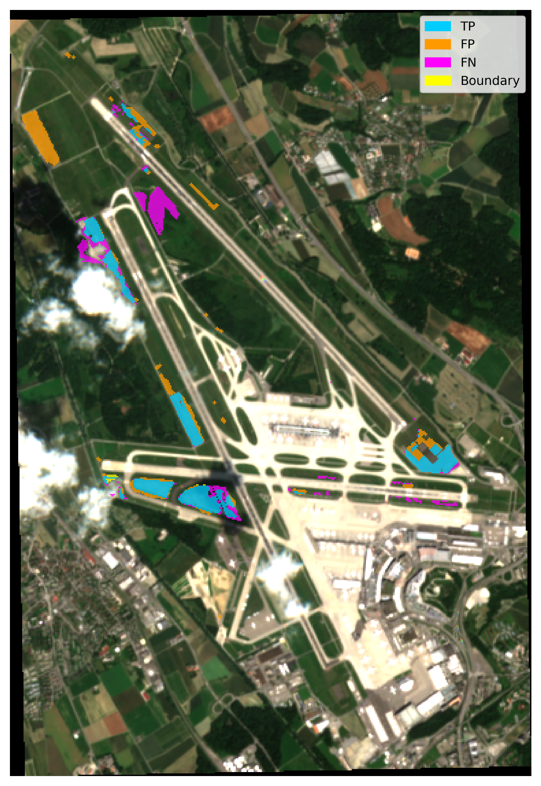{#fig-pp-best}

Prediction maps for scene 46. (a) Raw prediction (F1 = 0.587). (b) After median + morphological postprocessing (F1 = 0.667). Cyan: true positive, orange: false positive, magenta: false negative, yellow: boundary-ambiguous (predicted mowed, but ground truth mowing occurred exactly on the after-image date itself, making those pixels uncertain).
:::


## Operational Scene Application {#sec-operational-results}

The trained models were applied to two held-out scenes (match_id 12 and 73) with available ground truth to evaluate operational performance. Each model was applied using its LOO-calibrated threshold, with and without the best postprocessing configuration. The full results are reported in @tbl-scene-results.

```{python}
#| tbl-cap: "Operational evaluation on held-out scenes 12 and 73. F1 raw and F1 PP denote performance without and with postprocessing respectively."
#| label: tbl-scene-results
#| echo: false

import pandas as pd
from great_tables import GT

data = pd.read_csv("tables/scene_evaluation_results.csv")

data = data.rename(columns={
    "match_id": "Scene",
    "model": "Model",
    "F1_raw": "F1 raw",
    "F1_pp": "F1 PP",
    "Prec_raw": "P raw",
    "Rec_raw": "R raw",
    "Prec_pp": "P PP",
    "Rec_pp": "R PP"
})

data = data.drop(columns=["threshold"])
data["Model"] = data["Model"].str.replace("_", " ")

(
    GT(data)
    .fmt_number(
        columns=["F1 raw", "F1 PP", "P raw", "R raw", "P PP", "R PP"],
        decimals=3
    )
    .tab_options(
        table_font_size="9pt",
        heading_title_font_size="12pt",
        data_row_padding="3px",
        table_border_top_color="black",
        table_border_bottom_color="black",
        heading_border_bottom_color="gray"
    )
    .opt_row_striping()
)

```

The best-performing model on scene 12 is the S2-only_diff SVM (F1 = 0.689 raw, 0.674 with postprocessing), followed closely by the S2-only_best SVM (0.667 raw, 0.673 with postprocessing) and the Full-fusion RF (0.675 raw, 0.669 with postprocessing). On scene 73, the S2-only_best RF achieves the highest F1 among S2-only models (0.749 raw, 0.735 with postprocessing). The Full-fusion RF performs comparably at 0.724. Across both scenes, the S2-based models consistently outperform all configurations that rely on SAR data alone. GRD-only and coherence-only models achieve F1-Scores around 0.200, with recall near 1.0 and precision near 0.11.

@fig-coh-failure shows the coherence-only RF prediction on scene 12. Despite the LOO-calibrated threshold of 0.1, the model predicts almost the entire grassland area as mowed, resulting in an F1-Score of 0.200.

{#fig-coh-failure width=60%}


### Comparison with PW2 Baseline

To directly assess the improvement over the previous study, the best-performing model from PW2 (SVM using ndii_diff as the sole feature, with a default threshold of 0.5) was applied to the same two scenes. On scene 73, the PW2 model achieves an F1-Score of 0.397 with a precision of 0.251 and recall of 0.938. The best current model (S2-only_best RF) reaches 0.749, with precision increasing to 0.706 and recall decreasing to 0.798.

::: {#fig-comparison-scene73 layout-ncol=2}

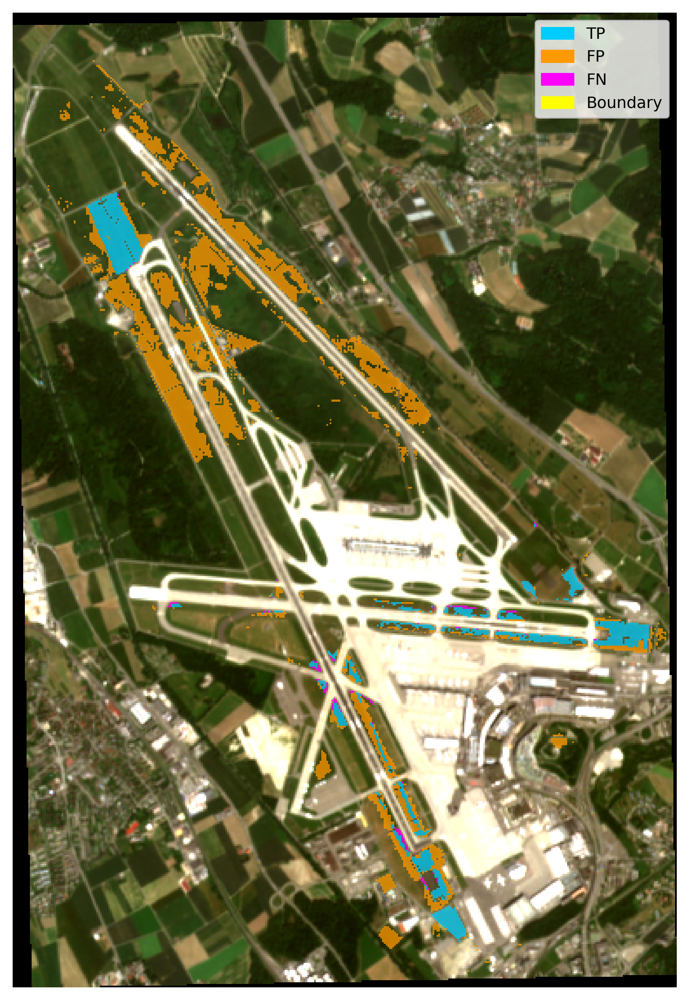{#fig-scene73-pw2}

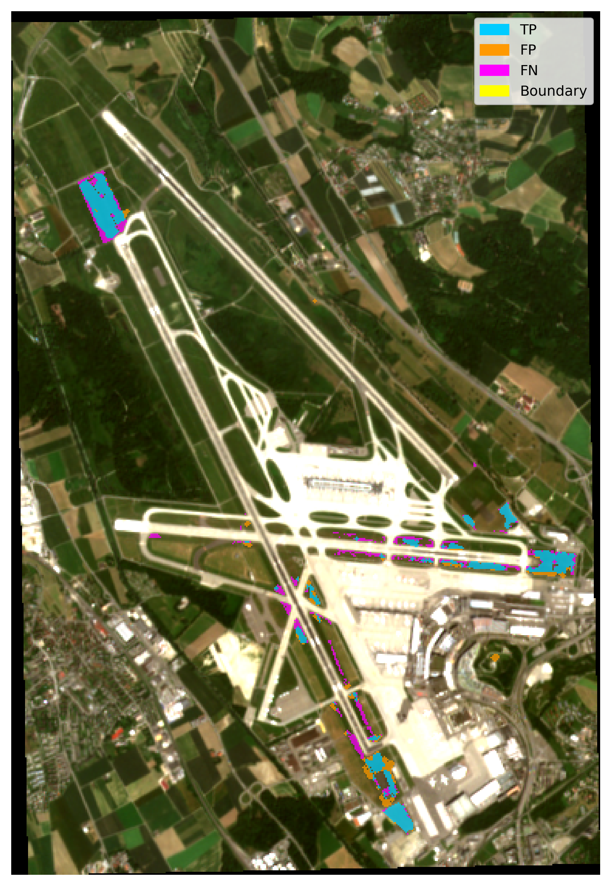{#fig-scene73-best}

Comparison of PW2 baseline and best model on scene 73. The PW2 model (left) produces widespread false positive detections due to the single-feature design and uncalibrated threshold. The improved workflow (right) achieves substantially higher precision while retaining most true positive detections. Cyan: true positive, orange: false positive, magenta: false negative, yellow: boundary-ambiguous (predicted mowed, but ground truth mowing occurred exactly on the after-image date itself, making those pixels uncertain).
:::

On scene 12, the improvement is smaller but consistent: the PW2 model achieves 0.597 while the best current model reaches 0.689.

::: {#fig-comparison-scene12 layout-ncol=2}

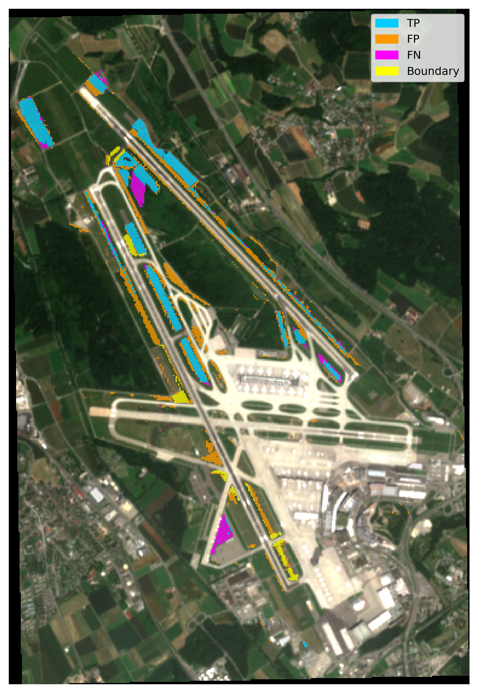{#fig-scene12-pw2}

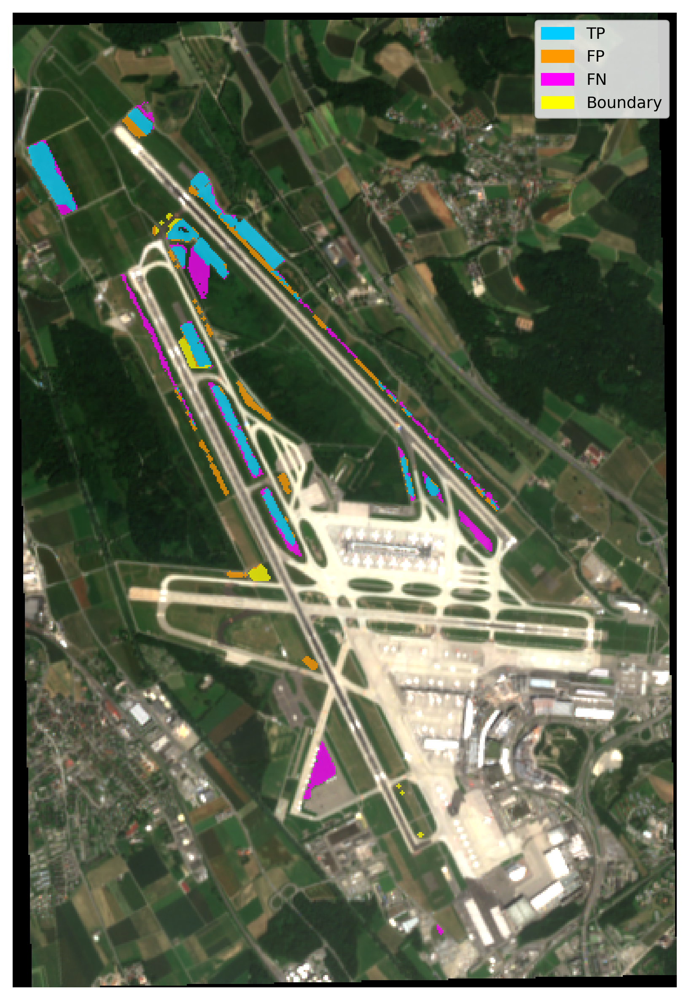{#fig-scene12-best}

Comparison of PW2 baseline and best model on scene 12. The pattern is consistent with scene 73: the improved model reduces false positives while maintaining coverage of the main mowing areas.
:::


## Generalisation Test

The S2-only_diff RF model was applied to a scene pair near Lindau (30.04.2025 to 10.05.2025) using the prototype notebook. No grassland mask or study area boundary was applied, meaning the model ran over the full scene extent including forests, roads, buildings, and agricultural cropland.

The evaluation against the four available ground truth polygons yields an F1-Score of 0.516 with a precision of 0.348 and recall of 0.995 (@fig-generalisation). The model detects virtually all known mowing pixels (2,027 true positives, 11 false negatives) but also predicts 3,793 pixels as mowed outside the ground truth polygons.

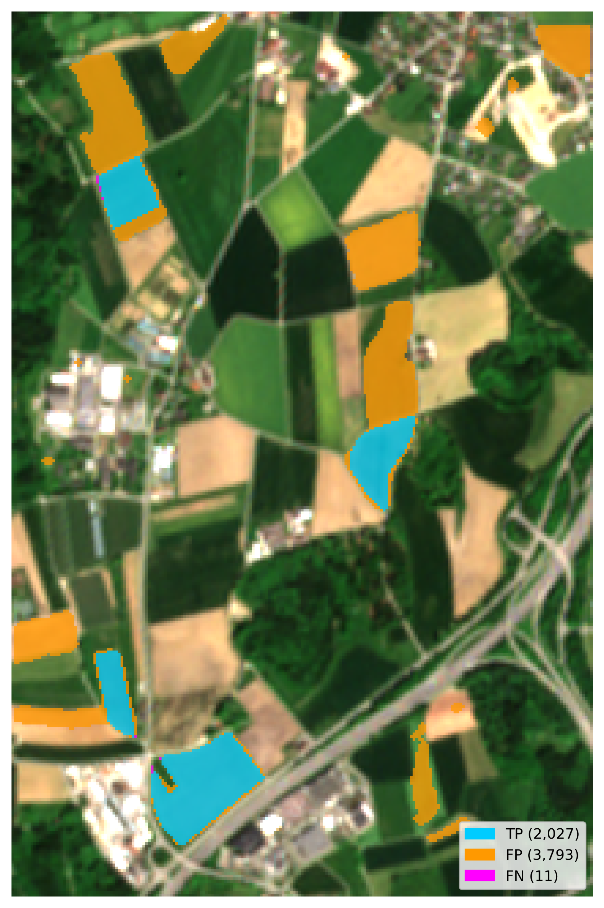{#fig-generalisation width=60%}

The ground truth covers only four parcels managed by Strickhof and does not account for mowing events on surrounding parcels managed by other farmers. Visual comparison of the before and after RGB composites shows that several of the areas flagged as false positives display spectral changes consistent with vegetation removal. The model does not predict mowing on non-grassland surfaces: forests, buildings, roads, and bare soil areas remain undetected despite the absence of a land cover mask.